# ER Diagram - Queue Management System

## Visual ER Diagram Overview

```
┌─────────────────────────────────────────────────────────────────────────┐
│                    QUEUE MANAGEMENT SYSTEM - ER DIAGRAM                  │
└─────────────────────────────────────────────────────────────────────────┘

                    ┌─────────────┐
                    │    USERS    │ (Base Table)
                    │  ─────────  │
                    │ id (PK)     │
                    │ email (UK)  │
                    │ password    │
                    │ first_name  │
                    │ last_name   │
                    │ phone       │
                    │ role        │
                    └──────┬──────┘
                           │
        ┌──────────────────┼──────────────────┐
        │ 1:1              │ 1:1              │ 1:1
        │                  │                  │
   ┌────▼────┐      ┌──────▼──────┐    ┌─────▼─────┐
   │CUSTOMERS│      │    STAFF    │    │  ADMINS  │
   │─────────│      │  ─────────  │    │ ────────  │
   │id (PK)  │      │ id (PK)     │    │ id (PK)  │
   │user_id  │      │ user_id     │    │ user_id  │
   │(FK→USERS)│     │ service_id  │    │(FK→USERS)│
   └────┬────┘      └──────┬──────┘    └──────────┘
        │                  │
        │ 1:N              │ N:1
        │                  │
   ┌────▼────┐      ┌──────▼──────┐
   │ TOKENS  │      │  SERVICES  │
   │─────────│      │  ─────────  │
   │id (PK)  │      │ id (PK)     │
   │token_num│      │ name        │
   │status   │      │ description │
   │customer │      │ duration    │
   │service  │      │ staff_id    │
   │position │      │ is_active   │
   └────┬────┘      └──────┬──────┘
        │                  │
        │                  │ 1:1
        │                  │
        │            ┌─────▼─────┐
        │            │  QUEUES  │
        │            │ ───────── │
        │            │ id (PK)   │
        │            │ service_id│
        │            │ position  │
        │            └─────┬─────┘
        │                  │
        │                  │ 1:N
        │                  │
        │            ┌─────▼──────────┐
        │            │ QUEUE_TOKENS  │
        │            │ ────────────── │
        │            │ id (PK)        │
        │            │ queue_id (FK)  │
        │            │ token_id (FK)  │
        │            │ position       │
        │            └─────┬──────────┘
        │                  │
        │                  │ 1:1
        │                  │
        └──────────────────┘
                │
                │ 1:N
                │
        ┌───────▼──────────┐
        │  NOTIFICATIONS   │
        │  ───────────────  │
        │ id (PK)          │
        │ token_id (FK)     │
        │ user_id (FK)      │
        │ type             │
        │ message          │
        └──────────────────┘

        ┌──────────────────┐
        │SERVICE_STATISTICS│
        │ ───────────────── │
        │ id (PK)          │
        │ service_id (FK)   │
        │ stat_date         │
        │ totals           │
        └──────────────────┘
```

## Entity Relationship Diagram (Mermaid Format)

```mermaid
erDiagram
    USERS {
        bigint id PK "Primary Key"
        varchar email UK "Unique, Not Null"
        varchar password_hash "Not Null"
        varchar first_name "Not Null"
        varchar last_name "Not Null"
        varchar phone_number "Nullable"
        enum role "CUSTOMER|STAFF|ADMIN"
        timestamp created_at "Default: CURRENT_TIMESTAMP"
        timestamp updated_at "Default: CURRENT_TIMESTAMP"
    }

    CUSTOMERS {
        bigint id PK "Primary Key"
        bigint user_id FK "References USERS(id), Unique, CASCADE DELETE"
        timestamp created_at "Default: CURRENT_TIMESTAMP"
        timestamp updated_at "Default: CURRENT_TIMESTAMP"
    }

    STAFF {
        bigint id PK "Primary Key"
        bigint user_id FK "References USERS(id), Unique, CASCADE DELETE"
        bigint service_id FK "References SERVICES(id), Nullable, SET NULL"
        boolean is_available "Default: TRUE"
        timestamp created_at "Default: CURRENT_TIMESTAMP"
        timestamp updated_at "Default: CURRENT_TIMESTAMP"
    }

    ADMINS {
        bigint id PK "Primary Key"
        bigint user_id FK "References USERS(id), Unique, CASCADE DELETE"
        timestamp created_at "Default: CURRENT_TIMESTAMP"
    }

    SERVICES {
        bigint id PK "Primary Key"
        varchar name "Not Null"
        text description "Nullable"
        integer estimated_duration_minutes "Not Null, CHECK > 0"
        boolean is_active "Default: TRUE"
        bigint staff_id FK "References STAFF(id), Nullable, SET NULL"
        timestamp created_at "Default: CURRENT_TIMESTAMP"
        timestamp updated_at "Default: CURRENT_TIMESTAMP"
    }

    TOKENS {
        bigint id PK "Primary Key"
        integer token_number "Not Null, Indexed"
        enum status "WAITING|IN_PROGRESS|COMPLETED|CANCELLED, Default: WAITING"
        bigint customer_id FK "References CUSTOMERS(id), Not Null, CASCADE DELETE"
        bigint service_id FK "References SERVICES(id), Not Null, CASCADE DELETE"
        integer queue_position "Default: 0, CHECK >= 0"
        integer estimated_wait_time_minutes "Default: 0, CHECK >= 0"
        timestamp created_at "Default: CURRENT_TIMESTAMP, Indexed"
        timestamp started_at "Nullable"
        timestamp completed_at "Nullable"
        timestamp cancelled_at "Nullable"
    }

    QUEUES {
        bigint id PK "Primary Key"
        bigint service_id FK "References SERVICES(id), Unique, CASCADE DELETE"
        integer current_position "Default: 0, CHECK >= 0"
        integer total_tokens_today "Default: 0, CHECK >= 0"
        timestamp created_at "Default: CURRENT_TIMESTAMP"
        timestamp updated_at "Default: CURRENT_TIMESTAMP"
    }

    QUEUE_TOKENS {
        bigint id PK "Primary Key"
        bigint queue_id FK "References QUEUES(id), Not Null, CASCADE DELETE"
        bigint token_id FK "References TOKENS(id), Unique, CASCADE DELETE"
        integer position_in_queue "Not Null, CHECK >= 0, Indexed"
        timestamp added_at "Default: CURRENT_TIMESTAMP"
    }

    NOTIFICATIONS {
        bigint id PK "Primary Key"
        bigint token_id FK "References TOKENS(id), Nullable, CASCADE DELETE"
        bigint user_id FK "References USERS(id), Not Null, CASCADE DELETE"
        enum notification_type "TOKEN_GENERATED|TOKEN_READY|SERVICE_STARTED|SERVICE_COMPLETED|QUEUE_UPDATE"
        varchar title "Not Null"
        text message "Not Null"
        boolean is_read "Default: FALSE, Indexed"
        timestamp sent_at "Default: CURRENT_TIMESTAMP, Indexed"
        timestamp read_at "Nullable"
    }

    SERVICE_STATISTICS {
        bigint id PK "Primary Key"
        bigint service_id FK "References SERVICES(id), Not Null, CASCADE DELETE"
        date stat_date "Not Null, Unique with service_id"
        integer total_tokens "Default: 0, CHECK >= 0"
        integer completed_tokens "Default: 0, CHECK >= 0"
        integer cancelled_tokens "Default: 0, CHECK >= 0"
        integer average_wait_time_minutes "Default: 0, CHECK >= 0"
        integer average_service_time_minutes "Default: 0, CHECK >= 0"
    }

    SYSTEM_SETTINGS {
        bigint id PK "Primary Key"
        varchar setting_key UK "Unique, Not Null"
        text setting_value "Not Null"
        varchar description "Nullable"
        timestamp updated_at "Default: CURRENT_TIMESTAMP"
    }

    %% Relationships - User Hierarchy (One-to-One)
    USERS ||--|| CUSTOMERS : "1:1 extends"
    USERS ||--|| STAFF : "1:1 extends"
    USERS ||--|| ADMINS : "1:1 extends"
    
    %% Relationships - Core Business Logic
    CUSTOMERS ||--o{ TOKENS : "1:N creates"
    SERVICES ||--o{ TOKENS : "1:N receives"
    SERVICES ||--o| STAFF : "N:1 assigned_staff"
    
    %% Relationships - Queue Management
    SERVICES ||--|| QUEUES : "1:1 has"
    QUEUES ||--o{ QUEUE_TOKENS : "1:N contains"
    TOKENS ||--|| QUEUE_TOKENS : "1:1 belongs_to"
    
    %% Relationships - Notifications
    TOKENS ||--o{ NOTIFICATIONS : "1:N generates"
    USERS ||--o{ NOTIFICATIONS : "1:N receives"
    
    %% Relationships - Statistics
    SERVICES ||--o{ SERVICE_STATISTICS : "1:N has"
```



## Visual Table Structure

### Table 1: USERS
| Column Name | Data Type | Constraints | Description |
|------------|-----------|-------------|-------------|
| **id** | BIGINT | PRIMARY KEY, AUTO_INCREMENT | Unique identifier |
| **email** | VARCHAR(255) | UNIQUE, NOT NULL, INDEXED | User email address |
| **password_hash** | VARCHAR(255) | NOT NULL | Hashed password |
| **first_name** | VARCHAR(100) | NOT NULL | First name |
| **last_name** | VARCHAR(100) | NOT NULL | Last name |
| **phone_number** | VARCHAR(20) | NULL | Contact number |
| **role** | ENUM | NOT NULL, DEFAULT 'CUSTOMER' | CUSTOMER, STAFF, ADMIN |
| **created_at** | TIMESTAMP | DEFAULT CURRENT_TIMESTAMP | Creation time |
| **updated_at** | TIMESTAMP | DEFAULT CURRENT_TIMESTAMP | Last update time |

**Relationships:**
- 1:1 → CUSTOMERS (via user_id)
- 1:1 → STAFF (via user_id)
- 1:1 → ADMINS (via user_id)
- 1:N → NOTIFICATIONS (via user_id)

---

### Table 2: CUSTOMERS
| Column Name | Data Type | Constraints | Description |
|------------|-----------|-------------|-------------|
| **id** | BIGINT | PRIMARY KEY, AUTO_INCREMENT | Unique identifier |
| **user_id** | BIGINT | FOREIGN KEY → USERS(id), UNIQUE, CASCADE DELETE | Reference to users table |
| **created_at** | TIMESTAMP | DEFAULT CURRENT_TIMESTAMP | Creation time |
| **updated_at** | TIMESTAMP | DEFAULT CURRENT_TIMESTAMP | Last update time |

**Relationships:**
- N:1 ← USERS (via user_id)
- 1:N → TOKENS (via customer_id)

---

### Table 3: STAFF
| Column Name | Data Type | Constraints | Description |
|------------|-----------|-------------|-------------|
| **id** | BIGINT | PRIMARY KEY, AUTO_INCREMENT | Unique identifier |
| **user_id** | BIGINT | FOREIGN KEY → USERS(id), UNIQUE, CASCADE DELETE | Reference to users table |
| **service_id** | BIGINT | FOREIGN KEY → SERVICES(id), NULLABLE, SET NULL | Assigned service |
| **is_available** | BOOLEAN | DEFAULT TRUE | Availability status |
| **created_at** | TIMESTAMP | DEFAULT CURRENT_TIMESTAMP | Creation time |
| **updated_at** | TIMESTAMP | DEFAULT CURRENT_TIMESTAMP | Last update time |

**Relationships:**
- N:1 ← USERS (via user_id)
- N:1 ← SERVICES (via service_id)

---

### Table 4: ADMINS
| Column Name | Data Type | Constraints | Description |
|------------|-----------|-------------|-------------|
| **id** | BIGINT | PRIMARY KEY, AUTO_INCREMENT | Unique identifier |
| **user_id** | BIGINT | FOREIGN KEY → USERS(id), UNIQUE, CASCADE DELETE | Reference to users table |
| **created_at** | TIMESTAMP | DEFAULT CURRENT_TIMESTAMP | Creation time |

**Relationships:**
- N:1 ← USERS (via user_id)

---

### Table 5: SERVICES
| Column Name | Data Type | Constraints | Description |
|------------|-----------|-------------|-------------|
| **id** | BIGINT | PRIMARY KEY, AUTO_INCREMENT | Unique identifier |
| **name** | VARCHAR(255) | NOT NULL, INDEXED | Service name |
| **description** | TEXT | NULLABLE | Service description |
| **estimated_duration_minutes** | INTEGER | NOT NULL, CHECK > 0 | Estimated duration |
| **is_active** | BOOLEAN | DEFAULT TRUE, INDEXED | Active status |
| **staff_id** | BIGINT | FOREIGN KEY → STAFF(id), NULLABLE, SET NULL | Assigned staff |
| **created_at** | TIMESTAMP | DEFAULT CURRENT_TIMESTAMP | Creation time |
| **updated_at** | TIMESTAMP | DEFAULT CURRENT_TIMESTAMP | Last update time |

**Relationships:**
- N:1 ← STAFF (via staff_id)
- 1:N → TOKENS (via service_id)
- 1:1 → QUEUES (via service_id)
- 1:N → SERVICE_STATISTICS (via service_id)

---

### Table 6: TOKENS
| Column Name | Data Type | Constraints | Description |
|------------|-----------|-------------|-------------|
| **id** | BIGINT | PRIMARY KEY, AUTO_INCREMENT | Unique identifier |
| **token_number** | INTEGER | NOT NULL, INDEXED | Display token number |
| **status** | ENUM | NOT NULL, DEFAULT 'WAITING', INDEXED | WAITING, IN_PROGRESS, COMPLETED, CANCELLED |
| **customer_id** | BIGINT | FOREIGN KEY → CUSTOMERS(id), NOT NULL, CASCADE DELETE | Customer owner |
| **service_id** | BIGINT | FOREIGN KEY → SERVICES(id), NOT NULL, CASCADE DELETE, INDEXED | Service requested |
| **queue_position** | INTEGER | DEFAULT 0, CHECK >= 0, INDEXED | Position in queue |
| **estimated_wait_time_minutes** | INTEGER | DEFAULT 0, CHECK >= 0 | Estimated wait time |
| **created_at** | TIMESTAMP | DEFAULT CURRENT_TIMESTAMP, INDEXED | Token creation time |
| **started_at** | TIMESTAMP | NULLABLE | Service start time |
| **completed_at** | TIMESTAMP | NULLABLE | Service completion time |
| **cancelled_at** | TIMESTAMP | NULLABLE | Cancellation time |

**Relationships:**
- N:1 ← CUSTOMERS (via customer_id)
- N:1 ← SERVICES (via service_id)
- 1:1 → QUEUE_TOKENS (via token_id)
- 1:N → NOTIFICATIONS (via token_id)

---

### Table 7: QUEUES
| Column Name | Data Type | Constraints | Description |
|------------|-----------|-------------|-------------|
| **id** | BIGINT | PRIMARY KEY, AUTO_INCREMENT | Unique identifier |
| **service_id** | BIGINT | FOREIGN KEY → SERVICES(id), UNIQUE, CASCADE DELETE | One queue per service |
| **current_position** | INTEGER | DEFAULT 0, CHECK >= 0, INDEXED | Current serving position |
| **total_tokens_today** | INTEGER | DEFAULT 0, CHECK >= 0 | Daily token count |
| **created_at** | TIMESTAMP | DEFAULT CURRENT_TIMESTAMP | Creation time |
| **updated_at** | TIMESTAMP | DEFAULT CURRENT_TIMESTAMP | Last update time |

**Relationships:**
- N:1 ← SERVICES (via service_id)
- 1:N → QUEUE_TOKENS (via queue_id)

---

### Table 8: QUEUE_TOKENS
| Column Name | Data Type | Constraints | Description |
|------------|-----------|-------------|-------------|
| **id** | BIGINT | PRIMARY KEY, AUTO_INCREMENT | Unique identifier |
| **queue_id** | BIGINT | FOREIGN KEY → QUEUES(id), NOT NULL, CASCADE DELETE, INDEXED | Queue reference |
| **token_id** | BIGINT | FOREIGN KEY → TOKENS(id), UNIQUE, CASCADE DELETE | Token reference |
| **position_in_queue** | INTEGER | NOT NULL, CHECK >= 0, INDEXED | Position in queue |
| **added_at** | TIMESTAMP | DEFAULT CURRENT_TIMESTAMP | Addition time |

**Relationships:**
- N:1 ← QUEUES (via queue_id)
- N:1 ← TOKENS (via token_id)

---

### Table 9: NOTIFICATIONS
| Column Name | Data Type | Constraints | Description |
|------------|-----------|-------------|-------------|
| **id** | BIGINT | PRIMARY KEY, AUTO_INCREMENT | Unique identifier |
| **token_id** | BIGINT | FOREIGN KEY → TOKENS(id), NULLABLE, CASCADE DELETE | Related token |
| **user_id** | BIGINT | FOREIGN KEY → USERS(id), NOT NULL, CASCADE DELETE, INDEXED | Recipient user |
| **notification_type** | ENUM | NOT NULL | TOKEN_GENERATED, TOKEN_READY, SERVICE_STARTED, SERVICE_COMPLETED, QUEUE_UPDATE |
| **title** | VARCHAR(255) | NOT NULL | Notification title |
| **message** | TEXT | NOT NULL | Notification message |
| **is_read** | BOOLEAN | DEFAULT FALSE, INDEXED | Read status |
| **sent_at** | TIMESTAMP | DEFAULT CURRENT_TIMESTAMP, INDEXED | Sent time |
| **read_at** | TIMESTAMP | NULLABLE | Read time |

**Relationships:**
- N:1 ← TOKENS (via token_id)
- N:1 ← USERS (via user_id)

---

### Table 10: SERVICE_STATISTICS
| Column Name | Data Type | Constraints | Description |
|------------|-----------|-------------|-------------|
| **id** | BIGINT | PRIMARY KEY, AUTO_INCREMENT | Unique identifier |
| **service_id** | BIGINT | FOREIGN KEY → SERVICES(id), NOT NULL, CASCADE DELETE, INDEXED | Service reference |
| **stat_date** | DATE | NOT NULL, UNIQUE with service_id | Statistics date |
| **total_tokens** | INTEGER | DEFAULT 0, CHECK >= 0 | Total tokens generated |
| **completed_tokens** | INTEGER | DEFAULT 0, CHECK >= 0 | Completed tokens |
| **cancelled_tokens** | INTEGER | DEFAULT 0, CHECK >= 0 | Cancelled tokens |
| **average_wait_time_minutes** | INTEGER | DEFAULT 0, CHECK >= 0 | Average wait time |
| **average_service_time_minutes** | INTEGER | DEFAULT 0, CHECK >= 0 | Average service time |

**Relationships:**
- N:1 ← SERVICES (via service_id)

---

### Table 11: SYSTEM_SETTINGS
| Column Name | Data Type | Constraints | Description |
|------------|-----------|-------------|-------------|
| **id** | BIGINT | PRIMARY KEY, AUTO_INCREMENT | Unique identifier |
| **setting_key** | VARCHAR(100) | UNIQUE, NOT NULL, INDEXED | Setting identifier |
| **setting_value** | TEXT | NOT NULL | Setting value |
| **description** | VARCHAR(500) | NULLABLE | Setting description |
| **updated_at** | TIMESTAMP | DEFAULT CURRENT_TIMESTAMP | Last update time |

**Relationships:** None (Standalone configuration table)

---

## Database Schema Details

### Table: USERS
**Description**: Base table storing all user information
- **Primary Key**: id
- **Unique Constraints**: email
- **Indexes**: email, role
- **Relationships**: 
  - One-to-One with CUSTOMERS, STAFF, ADMINS

### Table: CUSTOMERS
**Description**: Customer-specific information
- **Primary Key**: id
- **Foreign Keys**: user_id → USERS(id)
- **Relationships**: 
  - One-to-Many with TOKENS

### Table: STAFF
**Description**: Staff member information and assignments
- **Primary Key**: id
- **Foreign Keys**: 
  - user_id → USERS(id)
  - service_id → SERVICES(id)
- **Relationships**: 
  - Many-to-One with SERVICES

### Table: ADMINS
**Description**: Administrator accounts
- **Primary Key**: id
- **Foreign Keys**: user_id → USERS(id)

### Table: SERVICES
**Description**: Services offered (e.g., Haircut, Consultation)
- **Primary Key**: id
- **Foreign Keys**: staff_id → STAFF(id)
- **Indexes**: is_active, name
- **Relationships**: 
  - One-to-Many with TOKENS
  - One-to-One with QUEUES
  - One-to-Many with SERVICE_STATISTICS

### Table: TOKENS
**Description**: Queue tokens assigned to customers
- **Primary Key**: id
- **Foreign Keys**: 
  - customer_id → CUSTOMERS(id)
  - service_id → SERVICES(id)
- **Indexes**: token_number, status, created_at, service_id
- **Status Values**: WAITING, IN_PROGRESS, COMPLETED, CANCELLED
- **Relationships**: 
  - Many-to-One with CUSTOMERS
  - Many-to-One with SERVICES
  - One-to-Many with NOTIFICATIONS
  - One-to-One with QUEUE_TOKENS

### Table: QUEUES
**Description**: Queue management for each service
- **Primary Key**: id
- **Foreign Keys**: service_id → SERVICES(id)
- **Unique Constraints**: service_id (one queue per service)
- **Relationships**: 
  - One-to-Many with QUEUE_TOKENS

### Table: QUEUE_TOKENS
**Description**: Junction table linking tokens to queues with position
- **Primary Key**: id
- **Foreign Keys**: 
  - queue_id → QUEUES(id)
  - token_id → TOKENS(id)
- **Indexes**: queue_id, position_in_queue
- **Purpose**: Maintains queue order and positions

### Table: NOTIFICATIONS
**Description**: Notifications sent to users
- **Primary Key**: id
- **Foreign Keys**: 
  - token_id → TOKENS(id)
  - user_id → USERS(id)
- **Indexes**: user_id, is_read, sent_at
- **Notification Types**: TOKEN_GENERATED, TOKEN_READY, SERVICE_STARTED, SERVICE_COMPLETED, QUEUE_UPDATE
- **Relationships**: 
  - Many-to-One with TOKENS
  - Many-to-One with USERS

### Table: SERVICE_STATISTICS
**Description**: Daily statistics for each service
- **Primary Key**: id
- **Foreign Keys**: service_id → SERVICES(id)
- **Indexes**: service_id, stat_date
- **Unique Constraints**: (service_id, stat_date)
- **Relationships**: 
  - Many-to-One with SERVICES

### Table: SYSTEM_SETTINGS
**Description**: System configuration settings
- **Primary Key**: id
- **Unique Constraints**: setting_key
- **Examples**: 
  - working_hours_start
  - working_hours_end
  - max_tokens_per_customer
  - notification_enabled

## Visual Relationship Diagram

```
┌─────────────────────────────────────────────────────────────────────────┐
│                    RELATIONSHIP VISUALIZATION                            │
└─────────────────────────────────────────────────────────────────────────┘

USERS (1) ──────┬─────────────── (1:1) ──────── CUSTOMERS (1)
                │
                ├─────────────── (1:1) ──────── STAFF (N)
                │                                    │
                └─────────────── (1:1) ──────── ADMINS (1)
                                                      │
CUSTOMERS (1) ──────── (1:N) ────────► TOKENS (N) ◄─────── (1:N) ─────── SERVICES (1)
                                                      │                      │
                                                      │                      │ (1:1)
                                                      │                      │
                                                      │                  QUEUES (1)
                                                      │                      │
                                                      │                      │ (1:N)
                                                      │                      │
                                                      │              QUEUE_TOKENS (N)
                                                      │                      │
                                                      │                      │ (1:1)
                                                      │                      │
                                                      └──────────────────────┘
                                                              │
                                                              │ (1:N)
                                                              │
                                                      NOTIFICATIONS (N)
                                                              │
                                                              │ (N:1)
                                                              │
                                                          USERS (1)

SERVICES (1) ──────── (1:N) ────────► SERVICE_STATISTICS (N)

SERVICES (1) ◄─────── (N:1) ──────── STAFF (N)
```

## Relationship Matrix Table

| From Table | To Table | Relationship Type | Foreign Key Column | Cardinality | Delete Rule |
|-----------|----------|-------------------|-------------------|-------------|-------------|
| **USERS** | **CUSTOMERS** | One-to-One | CUSTOMERS.user_id → USERS.id | 1:1 | CASCADE |
| **USERS** | **STAFF** | One-to-One | STAFF.user_id → USERS.id | 1:1 | CASCADE |
| **USERS** | **ADMINS** | One-to-One | ADMINS.user_id → USERS.id | 1:1 | CASCADE |
| **CUSTOMERS** | **TOKENS** | One-to-Many | TOKENS.customer_id → CUSTOMERS.id | 1:N | CASCADE |
| **SERVICES** | **TOKENS** | One-to-Many | TOKENS.service_id → SERVICES.id | 1:N | CASCADE |
| **SERVICES** | **STAFF** | One-to-Many | SERVICES.staff_id → STAFF.id | N:1 | SET NULL |
| **SERVICES** | **QUEUES** | One-to-One | QUEUES.service_id → SERVICES.id | 1:1 | CASCADE |
| **SERVICES** | **SERVICE_STATISTICS** | One-to-Many | SERVICE_STATISTICS.service_id → SERVICES.id | 1:N | CASCADE |
| **QUEUES** | **QUEUE_TOKENS** | One-to-Many | QUEUE_TOKENS.queue_id → QUEUES.id | 1:N | CASCADE |
| **TOKENS** | **QUEUE_TOKENS** | One-to-One | QUEUE_TOKENS.token_id → TOKENS.id | 1:1 | CASCADE |
| **TOKENS** | **NOTIFICATIONS** | One-to-Many | NOTIFICATIONS.token_id → TOKENS.id | 1:N | CASCADE |
| **USERS** | **NOTIFICATIONS** | One-to-Many | NOTIFICATIONS.user_id → USERS.id | 1:N | CASCADE |

## Relationships Summary

1. **USERS → CUSTOMERS/STAFF/ADMINS**: One-to-One (Inheritance pattern)
2. **CUSTOMERS → TOKENS**: One-to-Many
3. **SERVICES → TOKENS**: One-to-Many
4. **SERVICES → QUEUES**: One-to-One
5. **QUEUES → QUEUE_TOKENS**: One-to-Many
6. **TOKENS → QUEUE_TOKENS**: One-to-One
7. **TOKENS → NOTIFICATIONS**: One-to-Many
8. **USERS → NOTIFICATIONS**: One-to-Many
9. **SERVICES → STAFF**: Many-to-One
10. **SERVICES → SERVICE_STATISTICS**: One-to-Many

## Indexes for Performance

- **USERS**: email, role
- **TOKENS**: token_number, status, created_at, service_id, customer_id
- **QUEUE_TOKENS**: queue_id, position_in_queue
- **NOTIFICATIONS**: user_id, is_read, sent_at
- **SERVICES**: is_active, name
- **SERVICE_STATISTICS**: service_id, stat_date

## Constraints

- **CASCADE DELETE**: 
  - Deleting a USER cascades to CUSTOMER/STAFF/ADMIN
  - Deleting a SERVICE cascades to QUEUE and TOKENS
  - Deleting a TOKEN cascades to QUEUE_TOKENS and NOTIFICATIONS

- **CHECK Constraints**:
  - TOKENS.status must be one of: WAITING, IN_PROGRESS, COMPLETED, CANCELLED
  - TOKENS.queue_position must be >= 0
  - TOKENS.estimated_wait_time_minutes must be >= 0
  - SERVICES.estimated_duration_minutes must be > 0
  - USERS.email must match email format pattern
  - QUEUES.current_position must be >= 0
  - QUEUES.total_tokens_today must be >= 0
  - SERVICE_STATISTICS all token counts must be >= 0

## Table Relationships Summary

### One-to-One Relationships:
1. **USERS ↔ CUSTOMERS**: One user can have one customer record
2. **USERS ↔ STAFF**: One user can have one staff record
3. **USERS ↔ ADMINS**: One user can have one admin record
4. **SERVICES ↔ QUEUES**: One service has one queue
5. **TOKENS ↔ QUEUE_TOKENS**: One token has one queue position record

### One-to-Many Relationships:
1. **CUSTOMERS → TOKENS**: One customer can create multiple tokens
2. **SERVICES → TOKENS**: One service can receive multiple tokens
3. **SERVICES → SERVICE_STATISTICS**: One service has multiple daily statistics
4. **QUEUES → QUEUE_TOKENS**: One queue contains multiple token positions
5. **TOKENS → NOTIFICATIONS**: One token can generate multiple notifications
6. **USERS → NOTIFICATIONS**: One user can receive multiple notifications
7. **STAFF → SERVICES**: One staff can be assigned to multiple services (if needed)

### Many-to-One Relationships:
1. **TOKENS → CUSTOMERS**: Many tokens belong to one customer
2. **TOKENS → SERVICES**: Many tokens belong to one service
3. **QUEUE_TOKENS → QUEUES**: Many queue positions belong to one queue
4. **NOTIFICATIONS → TOKENS**: Many notifications reference one token
5. **NOTIFICATIONS → USERS**: Many notifications sent to one user
6. **SERVICE_STATISTICS → SERVICES**: Many statistics belong to one service
7. **SERVICES → STAFF**: Many services can be assigned to one staff (if needed)

## Visual Table Summary

```
┌─────────────────────────────────────────────────────────────────────────┐
│                         ALL TABLES SUMMARY                               │
└─────────────────────────────────────────────────────────────────────────┘

┌──────────────┬──────────────┬──────────────┬──────────────────────────┐
│ Table Name   │ Primary Key  │ Foreign Keys │ Key Relationships        │
├──────────────┼──────────────┼──────────────┼──────────────────────────┤
│ USERS        │ id           │ -            │ → CUSTOMERS (1:1)        │
│              │              │              │ → STAFF (1:1)            │
│              │              │              │ → ADMINS (1:1)           │
│              │              │              │ → NOTIFICATIONS (1:N)     │
├──────────────┼──────────────┼──────────────┼──────────────────────────┤
│ CUSTOMERS    │ id           │ user_id      │ ← USERS (1:1)            │
│              │              │              │ → TOKENS (1:N)           │
├──────────────┼──────────────┼──────────────┼──────────────────────────┤
│ STAFF        │ id           │ user_id      │ ← USERS (1:1)            │
│              │              │ service_id   │ ← SERVICES (N:1)         │
├──────────────┼──────────────┼──────────────┼──────────────────────────┤
│ ADMINS       │ id           │ user_id      │ ← USERS (1:1)            │
├──────────────┼──────────────┼──────────────┼──────────────────────────┤
│ SERVICES     │ id           │ staff_id     │ ← STAFF (N:1)             │
│              │              │              │ → TOKENS (1:N)           │
│              │              │              │ → QUEUES (1:1)           │
│              │              │              │ → SERVICE_STATISTICS(1:N)│
├──────────────┼──────────────┼──────────────┼──────────────────────────┤
│ TOKENS       │ id           │ customer_id  │ ← CUSTOMERS (N:1)         │
│              │              │ service_id   │ ← SERVICES (N:1)          │
│              │              │              │ → QUEUE_TOKENS (1:1)     │
│              │              │              │ → NOTIFICATIONS (1:N)   │
├──────────────┼──────────────┼──────────────┼──────────────────────────┤
│ QUEUES       │ id           │ service_id   │ ← SERVICES (1:1)         │
│              │              │              │ → QUEUE_TOKENS (1:N)     │
├──────────────┼──────────────┼──────────────┼──────────────────────────┤
│ QUEUE_TOKENS │ id           │ queue_id     │ ← QUEUES (N:1)           │
│              │              │ token_id     │ ← TOKENS (N:1)           │
├──────────────┼──────────────┼──────────────┼──────────────────────────┤
│ NOTIFICATIONS│ id           │ token_id     │ ← TOKENS (N:1)           │
│              │              │ user_id      │ ← USERS (N:1)            │
├──────────────┼──────────────┼──────────────┼──────────────────────────┤
│ SERVICE_     │ id           │ service_id   │ ← SERVICES (N:1)         │
│ STATISTICS   │              │              │                          │
├──────────────┼──────────────┼──────────────┼──────────────────────────┤
│ SYSTEM_      │ id           │ -            │ (Standalone)             │
│ SETTINGS     │              │              │                          │
└──────────────┴──────────────┴──────────────┴──────────────────────────┘

Total Tables: 11
Total Relationships: 13
One-to-One: 5
One-to-Many: 6
Many-to-One: 2
```
