# Class Diagram - Queue Management System

## Visual Class Diagram Overview

```
┌─────────────────────────────────────────────────────────────────────────┐
│              QUEUE MANAGEMENT SYSTEM - CLASS DIAGRAM                    │
└─────────────────────────────────────────────────────────────────────────┘

┌─────────────────────────────────────────────────────────────────────────┐
│                          ENTITY LAYER                                    │
└─────────────────────────────────────────────────────────────────────────┘

                    ┌─────────────┐
                    │    User     │ ◄─── Base Class
                    │ ─────────── │
                    │ -id         │
                    │ -email      │
                    │ -password   │
                    │ -firstName  │
                    │ -lastName   │
                    │ -role       │
                    │ +login()    │
                    │ +logout()   │
                    └──────┬──────┘
                           │
        ┌──────────────────┼──────────────────┐
        │                  │                  │
   ┌────▼────┐      ┌──────▼──────┐    ┌─────▼─────┐
   │Customer │      │   Staff    │    │  Admin   │
   │─────────│      │ ────────── │    │ ────────  │
   │-id      │      │ -id        │    │ -id      │
   │-user    │      │ -user      │    │ -user    │
   │-tokens  │      │ -service   │    │ +manage  │
   │+joinQ() │      │ -tokens    │    │ +view()  │
   └────┬────┘      │ +process() │    └──────────┘
        │           └──────┬──────┘
        │                  │
        │ 1:N              │ N:1
        │                  │
   ┌────▼────┐      ┌──────▼──────┐
   │ Token   │      │  Service   │
   │─────────│      │ ──────────  │
   │-id      │      │ -id         │
   │-number  │      │ -name       │
   │-status  │      │ -duration   │
   │-customer│      │ -staff      │
   │-service │      │ -tokens     │
   │+update()│      │ +create()   │
   └────┬────┘      └──────┬──────┘
        │                  │
        │                  │ 1:1
        │                  │
        │            ┌─────▼─────┐
        │            │  Queue   │
        │            │ ──────── │
        │            │ -id      │
        │            │ -service │
        │            │ -tokens  │
        │            │ +add()   │
        │            └──────────┘
        │
        │ 1:N
        │
   ┌────▼──────────┐
   │ Notification  │
   │ ───────────── │
   │ -id           │
   │ -token        │
   │ -type         │
   │ -message      │
   │ +send()       │
   └───────────────┘

┌─────────────────────────────────────────────────────────────────────────┐
│                       CONTROLLER LAYER                                   │
└─────────────────────────────────────────────────────────────────────────┘

AuthController ────► AuthService ────► UserRepository
QueueController ────► QueueService ────► QueueRepository
ServiceController ──► ServiceService ──► ServiceRepository
UserController ─────► UserService ─────► UserRepository
AnalyticsController► AnalyticsService► StatisticsRepository

┌─────────────────────────────────────────────────────────────────────────┐
│                        SERVICE LAYER                                      │
└─────────────────────────────────────────────────────────────────────────┘

QueueService ────► TokenService ────► TokenRepository
              └───► NotificationService ────► NotificationRepository
              └───► QueueRepository

┌─────────────────────────────────────────────────────────────────────────┐
│                       REPOSITORY LAYER                                   │
└─────────────────────────────────────────────────────────────────────────┘

UserRepository ◄─── Database
TokenRepository ◄── Database
QueueRepository ◄── Database
ServiceRepository ◄── Database
NotificationRepository ◄── Database
```

## Class Diagram (Mermaid Format)

```mermaid
classDiagram
    %% Entity Classes
    class User {
        -Long id
        -String email
        -String password
        -String firstName
        -String lastName
        -String phoneNumber
        -Role role
        -LocalDateTime createdAt
        -LocalDateTime updatedAt
        +login()
        +logout()
        +updateProfile()
    }

    class Customer {
        -Long id
        -User user
        -List~Token~ tokens
        +joinQueue(Service)
        +viewTokenStatus()
        +cancelToken()
    }

    class Staff {
        -Long id
        -User user
        -Service service
        -List~Token~ assignedTokens
        +viewAssignedTokens()
        +markTokenInProgress()
        +completeService()
    }

    class Admin {
        -Long id
        -User user
        +manageUsers()
        +manageServices()
        +viewAnalytics()
        +configureSettings()
    }

    class Service {
        -Long id
        -String name
        -String description
        -Integer estimatedDuration
        -Boolean isActive
        -Staff assignedStaff
        -List~Token~ tokens
        +create()
        +update()
        +delete()
    }

    class Token {
        -Long id
        -Integer tokenNumber
        -TokenStatus status
        -Customer customer
        -Service service
        -LocalDateTime createdAt
        -LocalDateTime startedAt
        -LocalDateTime completedAt
        -Integer queuePosition
        -Integer estimatedWaitTime
        +generateTokenNumber()
        +updateStatus()
        +calculateWaitTime()
    }

    class Queue {
        -Long id
        -Service service
        -List~Token~ tokens
        -Integer currentPosition
        +addToken()
        +removeToken()
        +updatePositions()
        +getNextToken()
    }

    class Notification {
        -Long id
        -Token token
        -NotificationType type
        -String message
        -LocalDateTime sentAt
        -Boolean isRead
        +send()
        +markAsRead()
    }

    %% Enum Classes
    class Role {
        <<enumeration>>
        CUSTOMER
        STAFF
        ADMIN
    }

    class TokenStatus {
        <<enumeration>>
        WAITING
        IN_PROGRESS
        COMPLETED
        CANCELLED
    }

    class NotificationType {
        <<enumeration>>
        TOKEN_GENERATED
        TOKEN_READY
        SERVICE_STARTED
        SERVICE_COMPLETED
        QUEUE_UPDATE
    }

    %% Controller Classes
    class AuthController {
        -AuthService authService
        +login(LoginRequest)
        +register(RegisterRequest)
        +logout()
        +refreshToken()
    }

    class QueueController {
        -QueueService queueService
        +joinQueue(JoinQueueRequest)
        +getTokenStatus(tokenId)
        +cancelToken(tokenId)
        +getStaffTokens()
        +markTokenInProgress(tokenId)
        +completeService(tokenId)
    }

    class ServiceController {
        -ServiceService serviceService
        +createService(CreateServiceRequest)
        +updateService(serviceId, UpdateServiceRequest)
        +deleteService(serviceId)
        +getAllServices()
        +getServiceById(serviceId)
    }

    class UserController {
        -UserService userService
        +createUser(CreateUserRequest)
        +updateUser(userId, UpdateUserRequest)
        +deleteUser(userId)
        +getAllUsers()
        +getUserById(userId)
    }

    class AnalyticsController {
        -AnalyticsService analyticsService
        +getDashboardStats()
        +getQueueStatistics()
        +getServiceStatistics()
        +generateReport(dateRange)
    }

    %% Service Classes
    class AuthService {
        -UserRepository userRepository
        -JwtTokenProvider jwtTokenProvider
        -PasswordEncoder passwordEncoder
        +authenticate(email, password)
        +register(userData)
        +generateToken(user)
        +validateToken(token)
    }

    class QueueService {
        -QueueRepository queueRepository
        -TokenRepository tokenRepository
        -TokenService tokenService
        -NotificationService notificationService
        +joinQueue(userId, serviceId)
        +getTokenStatus(tokenId)
        +cancelToken(tokenId)
        +getStaffTokens(staffId)
        +markTokenInProgress(tokenId)
        +completeService(tokenId)
        +updateQueuePositions()
        +calculateWaitTime(tokenId)
    }

    class TokenService {
        -TokenRepository tokenRepository
        -QueueRepository queueRepository
        +generateToken(serviceId)
        +getTokenById(tokenId)
        +updateTokenStatus(tokenId, status)
        +calculateQueuePosition(tokenId)
        +calculateEstimatedWaitTime(tokenId)
    }

    class ServiceService {
        -ServiceRepository serviceRepository
        -StaffRepository staffRepository
        +createService(serviceData)
        +updateService(serviceId, serviceData)
        +deleteService(serviceId)
        +getAllServices()
        +getServiceById(serviceId)
        +assignStaff(serviceId, staffId)
    }

    class UserService {
        -UserRepository userRepository
        -PasswordEncoder passwordEncoder
        +createUser(userData)
        +updateUser(userId, userData)
        +deleteUser(userId)
        +getAllUsers()
        +getUserById(userId)
        +getUserByEmail(email)
    }

    class NotificationService {
        -NotificationRepository notificationRepository
        -EmailService emailService
        -SmsService smsService
        -WebSocketService webSocketService
        +sendTokenConfirmation(tokenId)
        +sendTokenReadyNotification(tokenId)
        +sendServiceStartedNotification(tokenId)
        +sendServiceCompletedNotification(tokenId)
        +sendQueueUpdateNotification(tokenId)
    }

    class AnalyticsService {
        -TokenRepository tokenRepository
        -QueueRepository queueRepository
        -ServiceRepository serviceRepository
        +getDashboardStats(dateRange)
        +getQueueStatistics(serviceId, dateRange)
        +getServiceStatistics(serviceId, dateRange)
        +getAverageWaitTime(dateRange)
        +getTotalTokensProcessed(dateRange)
        +generateReport(dateRange)
    }

    %% Repository Classes
    class UserRepository {
        <<interface>>
        +findById(id)
        +findByEmail(email)
        +save(user)
        +delete(user)
        +findAll()
    }

    class TokenRepository {
        <<interface>>
        +findById(id)
        +findByCustomerId(customerId)
        +findByServiceId(serviceId)
        +findByStatus(status)
        +save(token)
        +delete(token)
        +findActiveTokensByService(serviceId)
    }

    class QueueRepository {
        <<interface>>
        +findByServiceId(serviceId)
        +save(queue)
        +delete(queue)
        +findAll()
    }

    class ServiceRepository {
        <<interface>>
        +findById(id)
        +findAll()
        +findByIsActive(isActive)
        +save(service)
        +delete(service)
    }

    class NotificationRepository {
        <<interface>>
        +findById(id)
        +findByTokenId(tokenId)
        +save(notification)
        +findUnreadByUserId(userId)
    }

    class StaffRepository {
        <<interface>>
        +findById(id)
        +findByUserId(userId)
        +findByServiceId(serviceId)
        +save(staff)
        +delete(staff)
        +findAll()
    }

    class QueueTokenRepository {
        <<interface>>
        +findById(id)
        +findByQueueId(queueId)
        +findByTokenId(tokenId)
        +save(queueToken)
        +delete(queueToken)
        +findByQueueIdOrderByPosition(queueId)
    }

    class ServiceStatisticsRepository {
        <<interface>>
        +findById(id)
        +findByServiceId(serviceId)
        +findByServiceIdAndDate(serviceId, date)
        +save(statistics)
        +findAll()
    }

    class SystemSettingsRepository {
        <<interface>>
        +findByKey(key)
        +save(setting)
        +findAll()
        +delete(key)
    }

    %% Relationships
    User <|-- Customer
    User <|-- Staff
    User <|-- Admin
    
    Customer "1" --> "*" Token : has
    Staff "1" --> "1" Service : assigned_to
    Staff "1" --> "*" Token : processes
    Service "1" --> "1" Staff : has_staff
    Service "1" --> "*" Token : has
    Token "1" --> "*" Notification : generates
    
    Queue "1" --> "1" Service : manages
    Queue "1" --> "*" Token : contains
    
    AuthController --> AuthService : uses
    QueueController --> QueueService : uses
    ServiceController --> ServiceService : uses
    UserController --> UserService : uses
    AnalyticsController --> AnalyticsService : uses
    
    AuthService --> UserRepository : uses
    QueueService --> QueueRepository : uses
    QueueService --> TokenRepository : uses
    QueueService --> TokenService : uses
    QueueService --> NotificationService : uses
    TokenService --> TokenRepository : uses
    TokenService --> QueueRepository : uses
    ServiceService --> ServiceRepository : uses
    ServiceService --> StaffRepository : uses
    UserService --> UserRepository : uses
    NotificationService --> NotificationRepository : uses
    AnalyticsService --> TokenRepository : uses
    AnalyticsService --> QueueRepository : uses
    AnalyticsService --> ServiceRepository : uses
    AnalyticsService --> ServiceStatisticsRepository : uses
    TokenService --> QueueTokenRepository : uses
    QueueService --> QueueTokenRepository : uses
    
    Token --> TokenStatus : uses
    User --> Role : has
    Notification --> NotificationType : has
```



## Class Descriptions

### Entity Classes

**User**
- Base class for all users in the system
- Contains common user attributes (email, password, name, etc.)
- Implements authentication-related methods

**Customer**
- Extends User
- Represents customers/patients who join queues
- Has relationship with multiple Tokens

**Staff**
- Extends User
- Represents staff members who process tokens
- Assigned to a specific Service
- Processes multiple Tokens

**Admin**
- Extends User
- Has administrative privileges
- Can manage users, services, and view analytics

**Service**
- Represents services offered (e.g., Haircut, Consultation)
- Has estimated duration
- Can be active or inactive
- Assigned to a Staff member

**Token**
- Represents a queue token
- Has unique token number
- Tracks status and timing information
- Belongs to a Customer and Service

**Queue**
- Manages tokens for a specific Service
- Maintains queue order and positions
- Provides methods to add/remove tokens

**Notification**
- Represents notifications sent to users
- Tracks notification type and status
- Linked to a Token

### Controller Classes (REST API Layer)

**AuthController**: Handles authentication endpoints
**QueueController**: Handles queue management endpoints
**ServiceController**: Handles service CRUD operations
**UserController**: Handles user management endpoints
**AnalyticsController**: Handles analytics and reporting endpoints

### Service Classes (Business Logic Layer)

**AuthService**: Authentication and authorization logic
**QueueService**: Queue management business logic
**TokenService**: Token generation and management logic
**ServiceService**: Service management business logic
**UserService**: User management business logic
**NotificationService**: Notification sending logic
**AnalyticsService**: Analytics and reporting logic

### Repository Classes (Data Access Layer)

All repositories follow Repository Pattern:
- **UserRepository**: User data access
- **TokenRepository**: Token data access
- **QueueRepository**: Queue data access
- **ServiceRepository**: Service data access
- **NotificationRepository**: Notification data access
- **StaffRepository**: Staff data access
- **QueueTokenRepository**: Queue-Token junction table data access
- **ServiceStatisticsRepository**: Service statistics data access
- **SystemSettingsRepository**: System settings data access

### Design Patterns Used

1. **Repository Pattern**: All data access through repository interfaces
2. **Service Layer Pattern**: Business logic separated from controllers
3. **Strategy Pattern**: Different notification strategies (Email, SMS, WebSocket)
4. **Observer Pattern**: WebSocket notifications for real-time updates
5. **Factory Pattern**: Token generation logic
6. **Singleton Pattern**: Configuration and utility classes
