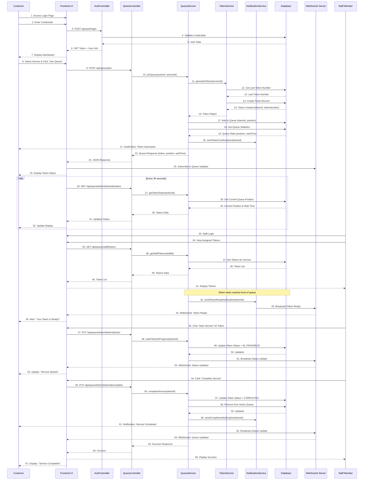
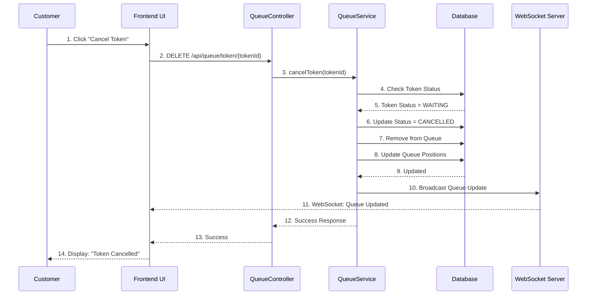
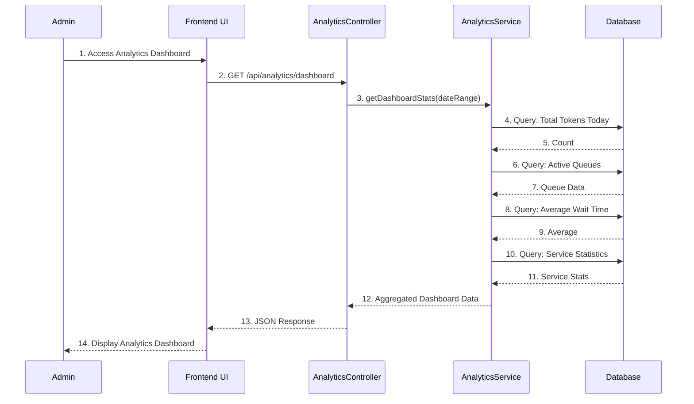

# Sequence Diagram - Queue Management System

## Visual Sequence Flow Overview

```
┌─────────────────────────────────────────────────────────────────────────┐
│        CUSTOMER JOINS QUEUE AND RECEIVES SERVICE - SEQUENCE FLOW         │
└─────────────────────────────────────────────────────────────────────────┘

Customer    Frontend    AuthCtrl    QueueCtrl   QueueSvc   TokenSvc   NotifSvc   Database   WebSocket   Staff
   │            │           │           │          │          │          │          │          │         │
   │──Login────►│           │           │          │          │          │          │          │         │
   │            │──POST────►│           │          │          │          │          │          │         │
   │            │           │──Validate─►│          │          │          │          │          │         │
   │            │           │◄──User────│          │          │          │          │          │         │
   │            │◄──Token───│           │          │          │          │          │          │         │
   │◄──Dashboard│           │           │          │          │          │          │          │         │
   │            │           │           │          │          │          │          │          │         │
   │──Join Q───►│           │           │          │          │          │          │          │         │
   │            │──POST────►│           │          │          │          │          │          │         │
   │            │           │──joinQ()─►│          │          │          │          │          │         │
   │            │           │           │──genToken│          │          │          │          │         │
   │            │           │           │          │──getLast─►│          │          │          │         │
   │            │           │           │          │          │◄──Number─│          │          │         │
   │            │           │           │          │──create─►│          │          │          │         │
   │            │           │           │          │          │◄──Token──│          │          │         │
   │            │           │           │          │──addQ()──►│          │          │          │         │
   │            │           │           │          │──getStats│          │          │          │         │
   │            │           │           │          │◄──Stats──│          │          │          │         │
   │            │           │           │          │──sendNotif│          │          │          │         │
   │◄──Notif────│           │           │          │          │          │          │          │         │
   │            │◄──Response│           │          │          │          │          │          │         │
   │◄──Token────│           │           │          │          │          │          │          │         │
   │            │──Subscribe│           │          │          │          │          │          │         │
   │            │           │           │          │          │          │          │          │         │
   │            │──GET──────│           │          │          │          │          │          │         │
   │            │           │──getStatus│          │          │          │          │          │         │
   │            │           │           │──getPos──►│          │          │          │          │         │
   │            │           │           │          │◄──Position│          │          │          │         │
   │            │◄──Updated─│           │          │          │          │          │          │         │
   │◄──Updated──│           │           │          │          │          │          │          │         │
   │            │           │           │          │          │          │          │          │         │
   │            │           │           │          │          │          │          │          │──Login──►│
   │            │           │           │          │          │          │          │          │         │
   │            │           │          │          │          │          │          │          │──View───►│
   │            │           │          │          │          │          │          │          │         │
   │            │           │          │          │──ready───►│          │          │          │         │
   │            │           │          │          │          │──broadcast│          │          │         │
   │◄──Ready────│           │          │          │          │          │          │          │         │
   │            │           │          │          │          │          │          │          │──Start──►│
   │            │           │          │──markIP──►│          │          │          │          │         │
   │            │           │          │          │──update──►│          │          │          │         │
   │            │           │          │          │          │──broadcast│          │          │         │
   │◄──Started──│           │          │          │          │          │          │          │         │
   │            │           │          │          │          │          │          │          │──Complete│
   │            │           │          │──complete│          │          │          │          │         │
   │            │           │          │          │──update──►│          │          │          │         │
   │            │           │          │          │──remove──►│          │          │          │         │
   │            │           │          │          │──sendNotif│          │          │          │         │
   │◄──Complete─│           │          │          │          │          │          │          │         │
   │            │           │          │          │          │──broadcast│          │          │         │
   │◄──Updated──│           │          │          │          │          │          │          │         │
```

## Main Flow: Customer Joins Queue and Receives Service (End-to-End)



## Alternative Flow: Customer Cancels Token



## Alternative Flow: Admin Views Analytics


