# Use Case Diagram - Queue Management System

## Visual Use Case Diagram Overview

```
┌─────────────────────────────────────────────────────────────────────────┐
│              QUEUE MANAGEMENT SYSTEM - USE CASE DIAGRAM                 │
└─────────────────────────────────────────────────────────────────────────┘

                    ┌─────────────────┐
                    │   CUSTOMER     │
                    │   / PATIENT     │
                    └────────┬────────┘
                             │
        ┌────────────────────┼────────────────────┐
        │                    │                    │
   ┌────▼────┐        ┌─────▼─────┐        ┌────▼────┐
   │Register │        │  Login    │        │Join Queue│
   └─────────┘        └───────────┘        └────┬────┘
                                                  │
        ┌─────────────────────────────────────────┼──────────────┐
        │                                         │              │
   ┌────▼──────────┐      ┌───────────┐   ┌────▼────┐   ┌────▼────┐
   │View Token     │      │View Queue │   │Cancel   │   │Receive  │
   │Status         │      │History    │   │Token    │   │Notif.   │
   └───────────────┘      └───────────┘   └─────────┘   └─────────┘

                    ┌─────────────────┐
                    │   STAFF MEMBER  │
                    └────────┬────────┘
                             │
        ┌────────────────────┼────────────────────┐
        │                    │                    │
   ┌────▼────┐        ┌─────▼─────┐        ┌────▼────┐
   │Staff    │        │View       │        │Mark     │
   │Login    │        │Assigned   │        │In-      │
   └─────────┘        │Tokens     │        │Progress │
                      └───────────┘        └────┬────┘
                                                 │
        ┌────────────────────────────────────────┼──────────────┐
        │                                        │              │
   ┌────▼──────────┐                    ┌──────▼────┐   ┌────▼────┐
   │Complete       │                    │View       │   │Update   │
   │Service        │                    │Service    │   │Service  │
   └───────────────┘                    │Statistics │   │Status   │
                                        └────────────┘   └─────────┘

                    ┌─────────────────┐
                    │ ADMINISTRATOR   │
                    └────────┬────────┘
                             │
        ┌────────────────────┼────────────────────┐
        │                    │                    │
   ┌────▼────┐        ┌─────▼─────┐        ┌────▼────┐
   │Admin    │        │Manage     │        │Manage   │
   │Login    │        │Users      │        │Services │
   └─────────┘        └───────────┘        └────┬────┘
                                                 │
        ┌────────────────────────────────────────┼────────────────────┐
        │                                        │                    │
   ┌────▼──────────┐      ┌───────────┐   ┌────▼────┐       ┌──────▼────┐
   │View All       │      │View       │   │Configure│       │Generate   │
   │Queues         │      │Analytics  │   │Settings │       │Reports    │
   └───────────────┘      └───────────┘   └─────────┘       └───────────┘

                    ┌─────────────────┐
                    │     SYSTEM      │
                    └────────┬────────┘
                             │
        ┌────────────────────┼────────────────────┐
        │                    │                    │
   ┌────▼────┐        ┌─────▼─────┐        ┌────▼────┐
   │Generate │        │Calculate  │        │Send     │
   │Token    │        │Wait Time  │        │Notif.   │
   └─────────┘        └───────────┘        └─────────┘
```

## Use Case Diagram (Mermaid Format)

```mermaid
graph TB
    Customer[Customer/Patient]
    Staff[Staff Member]
    Admin[Administrator]
    System[Queue Management System]
    
    %% Customer Use Cases
    Customer -->|UC1| Register[Register Account]
    Customer -->|UC2| Login[Login]
    Customer -->|UC3| JoinQueue[Join Queue]
    Customer -->|UC4| ViewTokenStatus[View Token Status]
    Customer -->|UC5| ViewQueueHistory[View Queue History]
    Customer -->|UC6| CancelToken[Cancel Token]
    Customer -->|UC7| ReceiveNotification[Receive Notifications]
    
    %% Staff Use Cases
    Staff -->|UC8| StaffLogin[Staff Login]
    Staff -->|UC9| ViewAssignedTokens[View Assigned Tokens]
    Staff -->|UC10| MarkTokenInProgress[Mark Token In-Progress]
    Staff -->|UC11| CompleteService[Complete Service]
    Staff -->|UC12| ViewServiceStats[View Service Statistics]
    Staff -->|UC13| UpdateServiceStatus[Update Service Status]
    
    %% Admin Use Cases
    Admin -->|UC14| AdminLogin[Admin Login]
    Admin -->|UC15| ManageUsers[Manage Users]
    Admin -->|UC15| ManageStaff[Manage Staff Accounts]
    Admin -->|UC16| ManageServices[Manage Services]
    Admin -->|UC17| ViewAllQueues[View All Queues]
    Admin -->|UC18| ViewAnalytics[View Analytics Dashboard]
    Admin -->|UC19| ConfigureSettings[Configure System Settings]
    Admin -->|UC20| GenerateReports[Generate Reports]
    
    %% System Use Cases
    System -->|UC21| GenerateToken[Generate Token Number]
    System -->|UC22| CalculateWaitTime[Calculate Estimated Wait Time]
    System -->|UC23| SendNotification[Send Notifications]
    System -->|UC24| UpdateQueuePosition[Update Queue Position]
    System -->|UC25| AuthenticateUser[Authenticate User]
    
    %% Relationships
    JoinQueue -.->|includes| GenerateToken
    JoinQueue -.->|includes| CalculateWaitTime
    ViewTokenStatus -.->|includes| UpdateQueuePosition
    CompleteService -.->|includes| SendNotification
    MarkTokenInProgress -.->|includes| UpdateQueuePosition
```



## Use Case Descriptions

### Customer Use Cases

**UC1: Register Account**
- **Actor**: Customer/Patient
- **Description**: Customer creates a new account with personal details
- **Preconditions**: None
- **Postconditions**: Customer account created, can login

**UC2: Login**
- **Actor**: Customer/Patient
- **Description**: Customer authenticates to access the system
- **Preconditions**: Customer must be registered
- **Postconditions**: Customer logged in, can access dashboard

**UC3: Join Queue**
- **Actor**: Customer/Patient
- **Description**: Customer selects a service and joins the queue
- **Preconditions**: Customer must be logged in, service must be available
- **Postconditions**: Token generated, customer added to queue

**UC4: View Token Status**
- **Actor**: Customer/Patient
- **Description**: Customer views their current token position and wait time
- **Preconditions**: Customer must have an active token
- **Postconditions**: Token status displayed

**UC5: View Queue History**
- **Actor**: Customer/Patient
- **Description**: Customer views their past queue records
- **Preconditions**: Customer must be logged in
- **Postconditions**: History displayed

**UC6: Cancel Token**
- **Actor**: Customer/Patient
- **Description**: Customer cancels their token before service
- **Preconditions**: Customer must have an active token
- **Postconditions**: Token cancelled, removed from queue

**UC7: Receive Notifications**
- **Actor**: Customer/Patient
- **Description**: Customer receives notifications about token status
- **Preconditions**: Customer must have an active token
- **Postconditions**: Notification sent and received

### Staff Use Cases

**UC8: Staff Login**
- **Actor**: Staff Member
- **Description**: Staff member authenticates to access staff dashboard
- **Preconditions**: Staff account must exist
- **Postconditions**: Staff logged in

**UC9: View Assigned Tokens**
- **Actor**: Staff Member
- **Description**: Staff views tokens assigned to their service
- **Preconditions**: Staff must be logged in
- **Postconditions**: Assigned tokens displayed

**UC10: Mark Token In-Progress**
- **Actor**: Staff Member
- **Description**: Staff marks a token as being serviced
- **Preconditions**: Token must be in waiting state
- **Postconditions**: Token status updated to in-progress

**UC11: Complete Service**
- **Actor**: Staff Member
- **Description**: Staff marks service as completed
- **Preconditions**: Token must be in-progress
- **Postconditions**: Token marked as completed, removed from queue

**UC12: View Service Statistics**
- **Actor**: Staff Member
- **Description**: Staff views daily statistics for their service
- **Preconditions**: Staff must be logged in
- **Postconditions**: Statistics displayed

**UC13: Update Service Status**
- **Actor**: Staff Member
- **Description**: Staff updates availability status of their service
- **Preconditions**: Staff must be logged in
- **Postconditions**: Service status updated

### Admin Use Cases

**UC14: Admin Login**
- **Actor**: Administrator
- **Description**: Admin authenticates to access admin dashboard
- **Preconditions**: Admin account must exist
- **Postconditions**: Admin logged in

**UC15: Manage Users**
- **Actor**: Administrator
- **Description**: Admin creates, updates, or deletes user accounts
- **Preconditions**: Admin must be logged in
- **Postconditions**: User accounts modified

**UC16: Manage Services**
- **Actor**: Administrator
- **Description**: Admin creates, updates, or deletes services
- **Preconditions**: Admin must be logged in
- **Postconditions**: Services modified

**UC17: View All Queues**
- **Actor**: Administrator
- **Description**: Admin monitors all active queues across all services
- **Preconditions**: Admin must be logged in
- **Postconditions**: All queues displayed

**UC18: View Analytics Dashboard**
- **Actor**: Administrator
- **Description**: Admin views comprehensive analytics and statistics
- **Preconditions**: Admin must be logged in
- **Postconditions**: Analytics displayed

**UC19: Configure System Settings**
- **Actor**: Administrator
- **Description**: Admin configures system parameters (working hours, limits, etc.)
- **Preconditions**: Admin must be logged in
- **Postconditions**: Settings updated

**UC20: Generate Reports**
- **Actor**: Administrator
- **Description**: Admin generates reports (daily, weekly, monthly)
- **Preconditions**: Admin must be logged in
- **Postconditions**: Report generated
